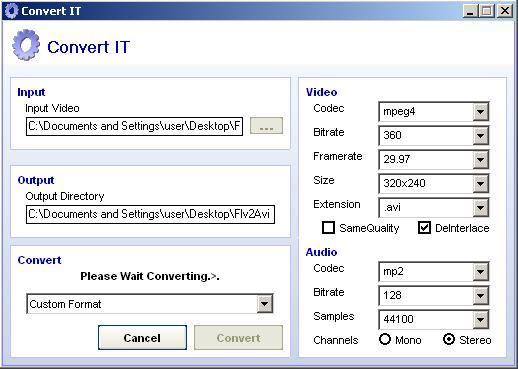

## ConvertIT Audio/Video Converter

### Description

Updated: 17/8/2011, to use ffmpeg-git-41bf67d and add webm support

this is an audio and video converter that uses FFMPEG, you can encode many formats including flv.

FFMPEG is an open source project this is the home page http://ffmpeg.mplayerhq.hu/

you will need to get avformat.dll to use this program, download it here.. https://rapidshare.com/files/2319667240/avformat.zip

or download a compiled ffmpeg.exe and rename it to avformat.dll.
 
### More Info
 

             |
---                |---
**Submitted On**   |2008-05-24 03:31:34
**By**             |[ DaZZa ](https://github.com/Planet-Source-Code/PSCIndex/blob/master/ByAuthor/dazza.md)
**Level**          |Intermediate
**User Rating**    |5.0 (75 globes from 15 users)
**Compatibility**  |VB 6\.0
**Category**       |[Files/ File Controls/ Input/ Output](https://github.com/Planet-Source-Code/PSCIndex/blob/master/ByCategory/files-file-controls-input-output__1-3.md)
**World**          |[Visual Basic](https://github.com/Planet-Source-Code/PSCIndex/blob/master/ByWorld/visual-basic.md)
**Archive File**   |[ConvertIT\_2209628172011\.zip](https://github.com/Planet-Source-Code/dazza-convertit-audio-video-converter__1-70578/archive/master.zip)

